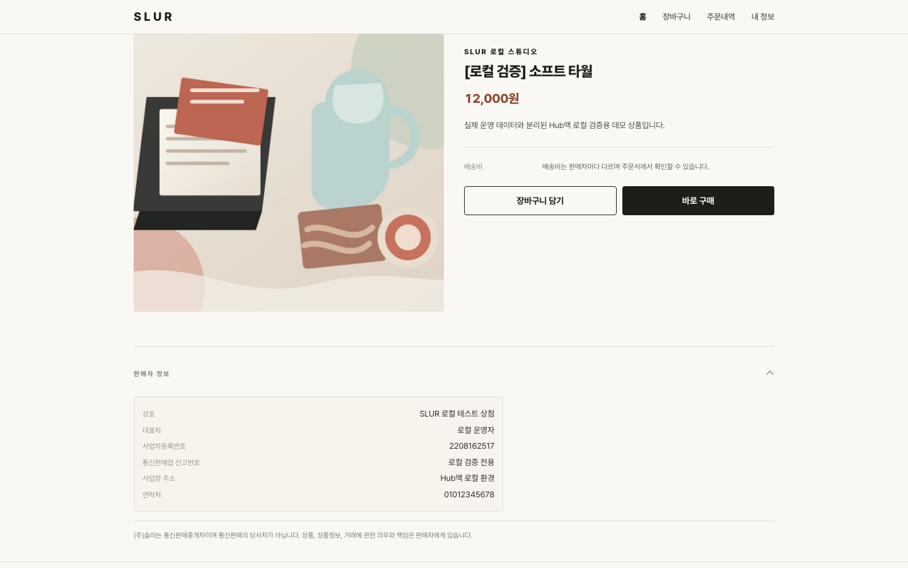
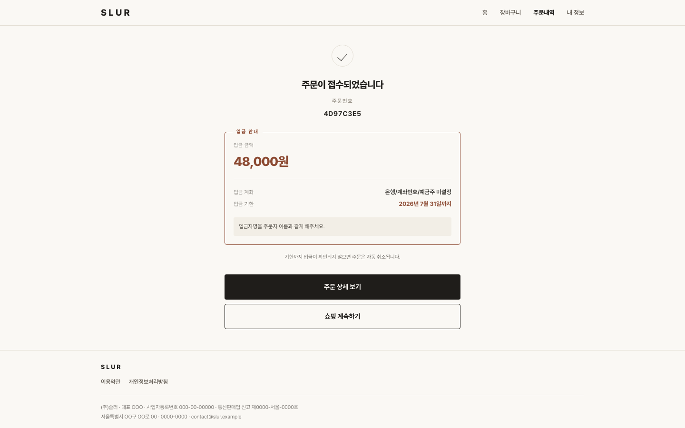
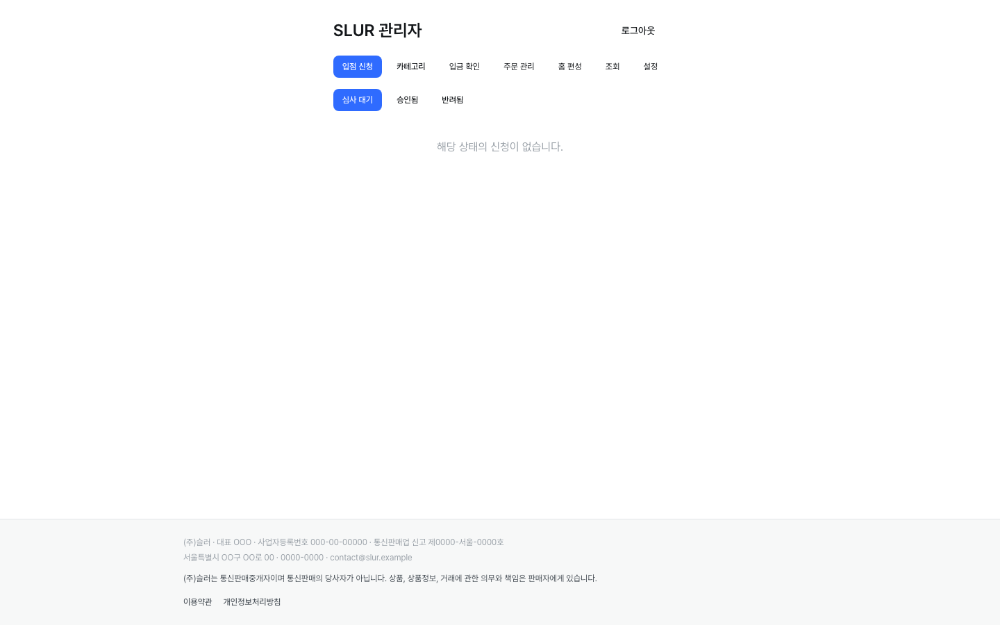
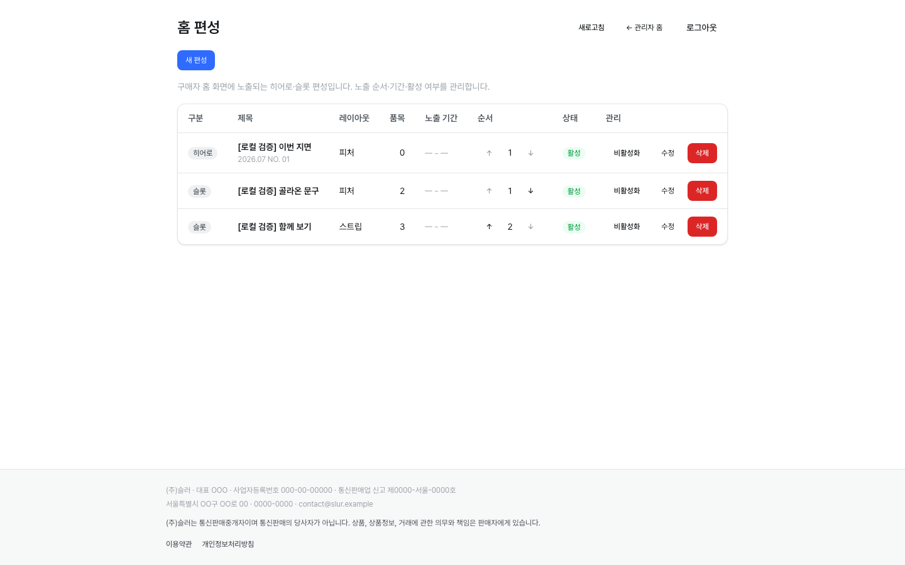

# SLUR Platform Blueprint

운영자가 판매자를 직접 선별·초청하는 **큐레이션형 디자인 편집숍 마켓플레이스**의 구현 블루프린트입니다.

SLUR 플랫폼 1호의 목표는 단기 매출이 아니라, 판매자 입점부터 상품·장바구니·주문·운영 관리까지의 **실서비스 흐름을 끝까지 검증**하는 것입니다. 이후 검증된 구조를 범용 커머스 플랫폼의 출발점으로 정리합니다.

> 현재 상태: v1 구현 완료 후 **자체 서버(Docker) 기반 사전 운영 검증** 단계입니다. PG 연동, 사업자 실정보·법률 검토 등 실제 외부 판매 오픈 게이트는 별도로 남아 있습니다.

## 무엇을 검증하나요?

- 단일 계정 기반의 구매자·판매자·관리자 역할 모델
- 이메일 및 카카오 로그인 경계
- 판매자 입점 신청과 관리자 승인
- 카테고리, 상품, 옵션 조합, 재고 관리
- 구매자 상품 탐색, 장바구니, 주문 생성
- 무통장입금 확인 기반의 주문·배송·취소 운영 흐름
- 판매자·관리자용 Next.js 콘솔
- 자체 서버에서의 Docker 통합 실행과 같은 네트워크 다른 기기의 LAN 검토

## 기능 안내

전체 기능을 화면 단위로 정리합니다. 하나의 계정이 **구매자·판매자·관리자** 역할을 겸할 수 있으며, 구매자는 반응형 웹, 판매자·관리자는 같은 웹의 콘솔 영역에서 역할로 분기합니다.

> **스크린샷** — 아래 화면들은 로컬 스택(`localhost:3000`)을 실제로 띄워 캡처한 것으로 `docs/screenshots/`에 있습니다. 데모 데이터 기준이며, 재촬영·갱신 방법은 아래 [촬영 가이드](#스크린샷-촬영-가이드)를 참고하세요. (데모 계정·시드는 [빠른 시작](#빠른-시작--자체-서버-로컬-검증) 참고)

### 구매자

#### 홈 — 운영자 편성 지면


- 운영자가 편성한 **히어로(이번 지면)** + **편성 슬롯**(고른 품목 묶음) + 카테고리 칩 + 전체 상품 그리드 + 푸터로 구성된 에디토리얼 홈.
- 편성이 없으면 서문형(큐레이션 문구 + 상품 목록)으로 자동 폴백합니다.
- 텍스트는 이미지 위에 얹지 않고 이미지 아래 블록에 둡니다(매거진 톤).

#### 상품 상세


- 이미지 갤러리(썸네일), 브랜드(판매자)명·상품명·가격·옵션.
- 판매자 신원 정보와 배송비, **중개자 고지**(통신판매중개자 고지), 담기·바로 구매.
- 품절은 숨기지 않고 채도↓·취소선으로 표기합니다.

#### 장바구니


- **판매자 묶음**별로 그룹화되어 묶음별 배송비를 계산합니다.
- 상품 이미지·이름을 누르면 상세로 이동하고, 수량 조절·삭제는 행 우측 컨트롤로 분리되어 있습니다.
- 주문 가능 항목 수 기준의 금액 요약과 주문하기.

#### 주문서 · 주문 완료



- 배송지 입력(다음 우편번호 검색), 무통장입금 안내, `주문하기` 위의 중개자 고지(규제 배치).
- 주문 완료 화면에서 주문번호와 입금 계좌를 안내합니다(v1 무통장입금 흐름).

#### 주문 내역 · 상세 · 취소


- 주문 목록과 상세, 상태(입금대기·결제완료·배송준비·배송중 등) 표시.
- 취소 가능 구간에서 구매자 취소, 취소된 묶음의 배송비 취소선 처리.

#### 내 정보


- 계정 정보, 주문 내역 진입, 로그아웃.
- 사업자 정보·중개자 고지(법적 고지)를 계정 조회 실패와 무관하게 표시. 데스크톱은 2단 구성.

#### 로그인 · 회원가입


- 이메일 로그인·가입과 **카카오 로그인**(웹 인가코드) 경계.
- 회원가입 필수 약관 동의, **이용약관·개인정보처리방침은 모달**로 열림(전체 화면 이탈 없이 확인, 독립 페이지는 딥링크 폴백).

### 모바일 뷰 (구매자)

구매자 표면은 모바일 퍼스트/PWA다. 같은 화면의 모바일 뷰(하단 탭바 포함):

<p>
  
  
  
  
  
  
  
</p>

### 판매자 콘솔

#### 대시보드 · 상품 관리


- 재고 임박 등 요약 대시보드.
- 상품 등록·수정(옵션 조합·재고), 이미지 사전서명 업로드(Storage 키 비노출).

#### 주문 관리


- 판매자 소유 묶음의 주문 확인과 배송 상태 처리(발송 등).

### 관리자 콘솔

#### 대시보드 · 입점 승인


- 관리자 대시보드, 판매자 입점 신청 검토·승인(초청·선별 모델의 관문).

#### 홈 편성 관리 (Epic 9)


- 구매자 홈의 히어로·편성 슬롯을 직접 편성: 제목·문장·대표 이미지·노출 상품 묶음·순서·노출 기간·활성 토글.
- 편성이 없으면 홈은 서문형으로 폴백합니다.

#### 입금 확인 · 회원/판매자/상품/주문 조회 · 카테고리 · 설정


- 무통장입금 수동 확인(입금 확인 시 배송 준비로 상태 전이).
- 회원·판매자·상품·주문 조회(읽기 중심), 카테고리 생성·순서 관리, 입금 계좌 등 설정.

### 공통 (전 역할)
- **인증·RBAC**: JWT + bcrypt, 역할 판정은 FastAPI가 소유. 웹은 힌트 쿠키로 UX 분기만.
- **주문 상태 전이**: 담기 → 주문 → 입금대기 → (관리자 입금확인) → 배송준비 → 배송중, 구간별 취소 규칙.
- **디자인 시스템**: 슬러 시스템(slur-ux·slur-design), 매거진 톤 B, 전 구매자 화면 공통 컨테이너 폭·푸터.

### 스크린샷 촬영 가이드

로컬 스택을 띄우고(`docker compose up -d --build --wait` + `docker compose --profile tools run --build --rm seed`), 아래 계정으로 로그인해 각 화면을 캡처한 뒤 `docs/screenshots/`에 저장합니다. (권장 폭 ~1280px)

| 파일명 | 화면 | 경로 | 계정 |
| --- | --- | --- | --- |
| `buyer-home.png` | 편성 홈 | `/` | 비로그인 |
| `buyer-product-detail.png` | 상품 상세 | `/products/{id}` | 비로그인 |
| `buyer-cart.png` | 장바구니 | `/cart` | 구매자 로그인 |
| `buyer-checkout.png` | 주문서 | `/checkout` | 구매자 로그인 |
| `buyer-orders.png` | 주문 내역 | `/orders` | 구매자 로그인 |
| `buyer-me.png` | 내 정보 | `/me` | 구매자 로그인 |
| `buyer-login.png` | 로그인(약관 모달) | `/login` | 비로그인 |
| `seller-products.png` | 판매자 상품 관리 | `/seller` | `local-seller@example.com` |
| `seller-orders.png` | 판매자 주문 관리 | `/seller` 주문 | `local-seller@example.com` |
| `admin-approvals.png` | 입점 승인 | `/admin` | `local-admin@example.com` |
| `admin-home-curation.png` | 홈 편성 관리 | `/admin/home` | `local-admin@example.com` |
| `admin-deposits.png` | 입금 확인 | `/admin/deposits` | `local-admin@example.com` |

> 로컬 계정 비밀번호와 시드 방법은 [빠른 시작](#빠른-시작--자체-서버-로컬-검증)의 3단계를 참고하세요. 데모 계정: 관리자 `local-admin@example.com` / `local-admin-password-2026`, 판매자 `local-seller@example.com` / `local-seller-password-2026`.

## 아키텍처

```text
구매자: Next.js 반응형 웹 (PWA)
판매자·관리자: Next.js 웹 콘솔 (역할 분기)
                  │
                  ▼
            FastAPI API
      인증 · RBAC · 주문 상태 전이
                  │
                  ▼
          PostgreSQL / Storage
```

- **FastAPI**가 인증, 권한, 상태 전이, 주문 로직의 유일한 소유자입니다.
- 구매자·판매자·관리자 웹은 모두 FastAPI API만 호출합니다. (초기 Flutter 구매자 앱은 반응형 웹으로 전환됐으며 `apps/mobile`은 제거 예정)
- **Supabase**는 향후 매니지드 PostgreSQL 및 Storage 연결 대상으로 두며, Supabase Auth·RLS·Edge Functions는 사용하지 않습니다.
- 현재 사전 운영 검증의 기본 DB는 운영 Supabase와 분리된 **Docker PostgreSQL**입니다.

## 기술 구성

- API: Python 3.14, FastAPI, SQLAlchemy Async, Alembic, PostgreSQL
- 웹: Next.js, TypeScript
- 모바일: Flutter
- 로컬 통합 실행: Docker Compose

## 빠른 시작 — 자체 서버 로컬 검증

### 준비물

- Docker Desktop
- Docker Compose

### 1. 로컬 환경변수 만들기

```bash
cp .env.example .env
```

`.env`의 아래 값은 로컬 전용 랜덤값으로 바꿉니다.

```bash
# 예시: 각각 별도의 값으로 생성
openssl rand -hex 32
```

- `POSTGRES_PASSWORD`
- `JWT_SECRET`

`.env`는 Git에서 제외됩니다. 실제 Supabase·카카오 비밀값은 저장소에 넣지 않습니다.

### 2. 전체 스택 실행

```bash
docker compose up -d --build --wait
```

Docker Compose가 다음 순서로 기동합니다.

```text
PostgreSQL → Alembic migration → FastAPI → Next.js
```

### 3. 로컬 데모 카탈로그 만들기

새 로컬 DB는 비어 있습니다. Supabase나 Railway 데이터를 복사하지 않고, 검증용 카테고리와 상품을 생성하려면 다음을 실행합니다.

```bash
docker compose --profile tools run --rm seed
```

- 카테고리 2개와 데모 상품 6개를 생성합니다.
- 로컬 환경과 Docker Postgres에서만 실행되도록 보호됩니다.
- 다시 실행해도 중복 생성하지 않습니다.
- Supabase Storage를 연결하지 않은 상태에서는 포함된 로컬 데모 이미지를 사용합니다.

### 4. 확인 주소

| 대상 | 주소 |
| --- | --- |
| 웹 | <http://localhost:3000> |
| API health | <http://localhost:8000/api/v1/health> |
| 같은 Wi‑Fi의 다른 기기 | `http://<서버-LAN-IP>:3000` |

서버에서 현재 LAN IP를 확인합니다.

```bash
ipconfig getifaddr en0
```

서버에 로컬 호스트명이 설정되어 있다면, 같은 Wi‑Fi의 다른 기기에서 `http://<서버-호스트명>.local:3000`처럼 `.local` 주소로도 접근할 수 있습니다.

> LAN URL은 내부 검토용 HTTP 서비스입니다. 라우터 포트포워딩이나 공개 터널을 기본으로 열지 않습니다.

## 검증

```bash
npm run test
```

이 명령은 Compose 구성, 서비스 준비 상태, API health, 웹 루트, 웹 BFF 카테고리 요청을 통합 점검합니다.

추가 API 테스트는 다음에서 실행합니다.

```bash
cd apps/api
uv run pytest -q
```

## 운영 명령

```bash
# 상태와 로그
docker compose ps
docker compose logs -f api web

# 중지 — DB 볼륨은 유지
docker compose down

# 완전 초기화 — 로컬 DB 볼륨까지 삭제
docker compose down -v
```

더 자세한 로컬 실행, 카카오 callback, 데이터 경계는 [LOCAL_DOCKER.md](LOCAL_DOCKER.md)를 참고하세요.

## 데이터 경계와 전환 원칙

- 로컬 Compose는 운영 Supabase의 데이터에 자동 연결·복사·수정하지 않습니다.
- 앱은 환경변수 기반 `DATABASE_URL`을 사용하므로, 별도 전환 검증 단계에서 Supabase PostgreSQL 연결 문자열로 교체할 수 있습니다.
- Storage도 환경변수 기반으로 분리되어 있습니다.
- 운영 DB 연결, 데이터 복제, 외부 고객 판매는 오픈 게이트를 검토한 뒤에만 진행합니다.

## 저장소 구조

```text
apps/
  api/          FastAPI API, Alembic migration, 도메인 테스트
  web/          Next.js 판매자·관리자·구매자 웹
  mobile/       Flutter 구매자 앱
_bmad-output/   PRD, 아키텍처, UX, 구현 산출물
docker-compose.yml
LOCAL_DOCKER.md
```

## 참고 문서

- [로컬 Docker 운영 가이드](LOCAL_DOCKER.md)
- [프로젝트 작업 규칙 및 아키텍처](CLAUDE.md)
- 기획·PRD·아키텍처 산출물: [`_bmad-output/`](_bmad-output/)

## 현재 제한 사항

이 저장소의 로컬 Docker 구성은 **실서비스 운영 가능성 검증용**입니다. 다음 항목은 실제 외부 판매 오픈 전 별도 완료가 필요합니다.

- PG 결제 연동
- 사업자 정보와 법률 고지의 실정보 검토
- 배송·도서산간 정책의 공식 기준 대조
- 실제 Supabase PostgreSQL·Storage 전환 검증
