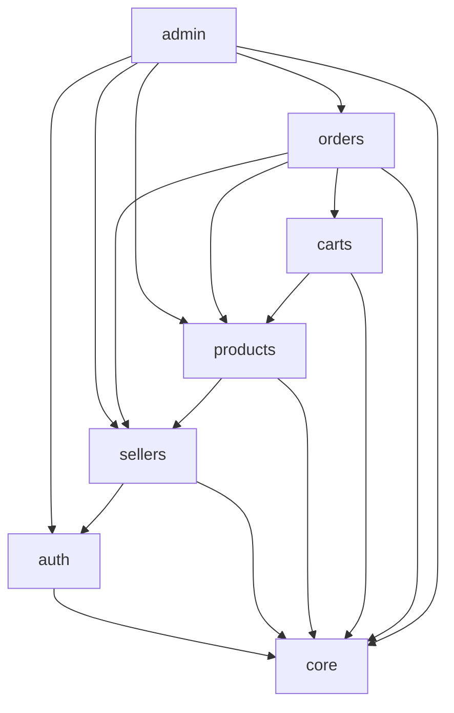
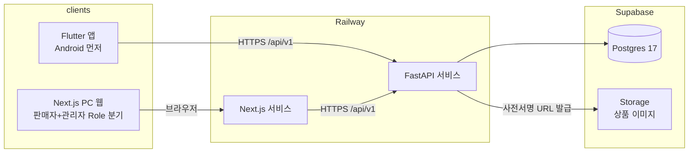
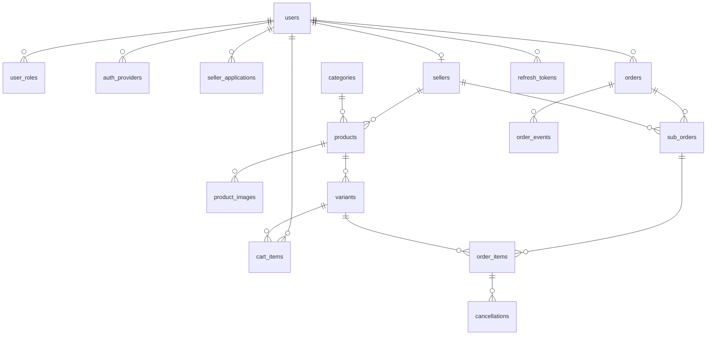

# Architecture Spine — SLUR 커머스 플랫폼 1호

## Design Paradigm

**도메인 모듈러 모놀리스.** FastAPI 단일 배포 단위 안에서 코드를 기술 계층이 아니라 도메인(업무 영역)별 패키지로 조직한다. 각 도메인 패키지는 자기 라우터·서비스·모델·스키마를 소유한다.

```
app/
  core/       # 설정, DB 세션, JWT·RBAC 의존성, 공통 에러 — 도메인 코드 금지
  auth/       # 가입·로그인·카카오 OAuth·역할
  sellers/    # 입점 신청·승인, 판매자 프로필, 배송비 설정
  products/   # 상품·카테고리·옵션(variant)·재고
  carts/      # 장바구니
  orders/     # 주문·하위주문·상태 전이·취소
  admin/      # 관리자 전용 라우터 (입금 확인, 강제 상태 변경, 조회)
```

새 기능은 "어느 도메인의 일인가"로 위치가 결정된다. 어느 도메인에도 속하지 않으면 새 도메인 패키지를 만들지, core로 갈지를 먼저 결정한다 — 임의로 걸치지 않는다.

## Invariants & Rules

### AD-1 — FastAPI가 유일한 문지기 `[ADOPTED]`

- **Binds:** all
- **Prevents:** 권한·비즈니스 로직이 클라이언트나 DB(RLS)로 분산되는 것
- **Rule:** 인증, RBAC, 상태 전이, 재고, 주문 로직은 FastAPI만 소유한다. Flutter·Next.js는 FastAPI API만 호출한다. Supabase Auth·RLS·Edge Functions 사용 금지 — Supabase는 매니지드 Postgres + Storage로만 쓴다.

### AD-2 — 도메인 간 의존 방향

- **Binds:** app/ 전체
- **Prevents:** 도메인끼리 뒤엉켜 모듈 경계가 무의미해지는 것
- **Rule:** 모든 도메인은 core에 의존할 수 있다. 도메인 간 호출은 상대 도메인의 service 함수를 통해서만 하고(라우터·모델 직접 import 금지), 순환 의존은 금지한다. 허용 방향:



(`orders → sellers`는 배송비 설정 참조용, `admin → auth`는 회원 관리용.)

### AD-3 — 주문 상태 전이는 전이표 + 단일 통로

- **Binds:** FR-18, FR-19, FR-28, FR-29
- **Prevents:** 엔드포인트마다 제각각의 상태 검사(누락 시 무결성 붕괴)
- **Rule:** 주문의 상태 기계는 **3층**이다 — `orders` 결제 상태, `sub_orders` 배송 상태, `order_items` 취소 상태. 세 층의 허용 전이는 모두 `orders` 도메인에 데이터(전이표)로 선언한다 — (엔티티 층, 현재 상태, 목표 상태, 허용 역할[`buyer`/`seller`/`admin`/`system`]). 층을 넘는 가드(예: "라인 취소 가능 여부는 소속 sub_order의 배송 상태로 판정")도 같은 모듈에 함수로 선언한다. 상태를 변경하는 공통 전이 함수는 하나뿐이며, 모든 코드 경로(구매자 취소, 관리자 입금확인·강제 변경, 판매자 배송 처리, 자동취소 배치=`system` 역할)는 이 함수만 호출한다. 세 층 모든 전이 성공은 `order_events`에 기록한다.

### AD-4 — 재고는 조건부 UPDATE로만 증감

- **Binds:** FR-10, FR-11, NFR-3
- **Prevents:** 동시 주문 시 음수 재고, 취소 시 유령 소진
- **Rule:** 재고 차감은 주문 생성 트랜잭션 안에서 `UPDATE ... SET stock = stock - n WHERE stock >= n` 형태의 조건부 UPDATE로만 한다 (읽고-계산하고-쓰기 금지). **재고 증감의 유일한 소유자는 orders 도메인의 전이 함수(AD-3)다** — 복원은 라인이 `canceled`로 확정되는 그 트랜잭션 안에서 정확히 1회 일어나며(환불 완료 시각과 무관), admin을 포함한 어떤 코드도 별도로 재고를 만지지 않는다. 애플리케이션 레벨 락·soft reservation 도입 금지 (Deferred 참조).

### AD-5 — 토큰은 FastAPI가 발급, 소셜은 신원 확인만

- **Binds:** FR-1, FR-2, NFR-2
- **Prevents:** 카카오 토큰이 API 인증 수단이 되어 인증 경로가 이원화되는 것
- **Rule:** 카카오 OAuth는 신원 확인까지만 쓰고, API 접근 토큰은 항상 FastAPI 자체 JWT다. 소셜 연결은 `auth_providers` 테이블(provider, provider_user_id)로 일반화해 제공자 추가 시 스키마 변경이 없어야 한다. 비밀번호 해시는 **Argon2id** (OWASP 현행 권고 — 브리프·PRD의 bcrypt 표기를 2026-07-15 Slur 승인으로 대체). refresh token은 `refresh_tokens` 테이블에 서버 저장 — 로그아웃·탈취 시 폐기 가능해야 한다.

### AD-6 — 취소 상태는 주문 라인에, 대표 상태는 파생

- **Binds:** FR-15, FR-18, FR-22, FR-29
- **Prevents:** 주문/하위주문/라인의 상태가 서로 어긋나는 것, 부분 취소 불가 구조
- **Rule:** 취소 상태는 `order_items`(라인) 레벨에 둔다. **구매자의 취소 단위는 판매자 묶음(sub_order)이다** — 해당 묶음이 배송준비 진입 전일 때 그 묶음의 전 라인 일괄 취소로 구현한다 (주문 전체 취소 = 모든 묶음 취소). 라인 단위 부분 취소는 관리자만 수행한다. 주문·하위주문의 "대표 상태"는 컬럼으로 저장하지 않고 라인·배송 상태에서 파생 계산한다. 취소 기록(사유·귀책·취소 시각·환불 완료 시각)은 `cancellations`에 남긴다.

### AD-7 — 주문 라인은 스냅샷

- **Binds:** FR-22, FR-25
- **Prevents:** 판매자의 상품 수정·삭제가 과거 주문 내역을 바꾸는 것
- **Rule:** `order_items`에는 주문 시점의 상품명·옵션 표시명·단가·추가금액을 복사해 저장한다. 주문 조회 화면은 스냅샷만 읽고, 원본 상품 참조(variant_id)는 재고 복원·연결용으로만 쓴다.

### AD-8 — 데이터 표현 불변 규칙

- **Binds:** all
- **Prevents:** 테이블·API마다 다른 ID/금액/시간 표현
- **Rule:** PK는 UUIDv7 — **생성은 앱 레이어(Python 3.14 `uuid.uuid7()`)에서 한다. PG17에는 네이티브 `uuidv7()`가 없다(PG18부터)** — DB 기본값에 의존하지 않는다. 금액은 원 단위 정수(소수점·부동소수 금지). 시간은 UTC `timestamptz` 저장, API는 ISO 8601. 상태값은 영어 소문자 snake_case enum (예: `pending_payment`, `paid`, `preparing`, `shipping`, `delivered`, `confirmed`, `canceled`) — 한국어 표시는 클라이언트 표현 계층의 일이다.

### AD-9 — ERD·마이그레이션은 승인 게이트 `[ADOPTED]`

- **Binds:** all (프로세스 규칙)
- **Prevents:** AI가 단독으로 스키마를 변경해 설계 통제가 무너지는 것
- **Rule:** 스키마 변경(신규 테이블·컬럼 변경·Alembic 마이그레이션 작성)은 초안 제시 → Slur 승인 후에만 적용한다.

### AD-10 — 구매 가능 판정은 단일 술어

- **Binds:** FR-10, FR-35, app/carts, app/orders
- **Prevents:** 장바구니와 주문서가 "구매 불가"를 서로 다르게 판정하는 것
- **Rule:** "이 variant를 지금 n개 살 수 있는가"의 판정 함수는 `products` 도메인에 하나만 존재하고(재고·조합 판매상태·상품 상태·상품 삭제를 모두 반영), carts와 orders는 이 함수만 호출한다. 주문 생성 성공 시 해당 장바구니 항목의 삭제는 orders가 같은 트랜잭션에서 수행한다.

### AD-11 — 배송비 계산은 orders가 소유하고 스냅샷한다

- **Binds:** FR-16, FR-17
- **Prevents:** 배송비 합산이 클라이언트·products·orders에 중복 구현되는 것, 판매자 설정 변경이 과거 주문 총액을 바꾸는 것
- **Rule:** 배송비·도서산간 추가비 계산은 `orders` 도메인의 함수 하나가 소유한다 (판매자 설정은 sellers 데이터를 읽고, 도서산간 판정은 `remote_area_zips` 참조 테이블로). 계산 결과는 주문 생성 시 `sub_orders`에 금액으로 스냅샷 저장한다. 클라이언트는 주문서 미리보기도 이 API의 계산 결과만 표시한다.

### AD-12 — 파생 값은 백엔드가 계산해 내려준다

- **Binds:** FR-15, FR-22, 두 클라이언트
- **Prevents:** Flutter와 Next.js가 같은 주문의 대표 상태·합계를 각자 계산해 다르게 표시하는 것
- **Rule:** 주문 대표 상태, 금액 합계, 취소 가능 여부 등 파생 값은 FastAPI가 계산해 API 응답 필드로 내려준다. 클라이언트는 파생 로직을 구현하지 않고 받은 값을 표시만 한다.

### AD-13 — SLUR 고유 값 하드코딩 금지 (블루프린트 규칙)

- **Binds:** all
- **Prevents:** 2차 목표(범용 블루프린트 추출) 시점에 SLUR 고유 값이 코드 전체에 박혀 분리 불가능해지는 것
- **Rule:** 브랜드명·입금 계좌·정책 수치(미입금 기한 3일, 품절 임박 5, 옵션 축 2 등)는 코드 상수 모듈(`core/config`) 또는 `settings` 테이블에만 둔다. 도메인 로직 본문에 리터럴로 쓰지 않는다.

## Consistency Conventions

| Concern | Convention |
| --- | --- |
| API | REST + JSON, `/api/v1/{복수형-리소스}`. 요청·응답 필드 snake_case. 페이지네이션은 page 기반 |
| 에러 봉투 | 모든 에러 응답은 `{code, message, details}` — `code`는 문자열 enum(분기용), `message`는 한국어(그대로 표시 가능), `details`는 필드별 배열. FastAPI 기본 422 응답(`detail` 필드 형식)도 전역 핸들러가 이 봉투로 변환한다. 클라이언트는 `code`로만 분기한다 |
| 주소 입력 | 우편번호·주소 검색은 카카오(다음) 우편번호 서비스 위젯/SDK (무료·키 불요) — 두 클라이언트 공통 |
| DB 명명 | 테이블 복수형 snake_case, FK는 `{단수형}_id`. enum은 PG native enum이 아닌 CHECK 제약 + 문자열 (enum 값 추가 시 마이그레이션 부담 회피) |
| 백엔드 파일 | 각 도메인 패키지 안에 `router.py`, `service.py`, `models.py`(SQLAlchemy), `schemas.py`(Pydantic) 고정 명명 |
| 프론트 | Next.js는 App Router + 슬러 시스템 CSS 규칙(`slur-ux`·`slur-design` 스킬). Flutter 상태관리는 Riverpod 3 |
| 인증 흐름 | access token 단기(30분) + refresh token — 두 클라이언트 공통 |
| 에러·로깅 | 도메인 서비스는 core의 공통 예외 타입을 던지고, 라우터는 잡지 않는다 — core의 전역 핸들러가 에러 봉투로 변환 |
| 이미지 | Supabase Storage 업로드는 FastAPI를 경유(사전서명 URL 발급) — 클라이언트가 Storage 키를 직접 갖지 않는다 (AD-1 연장) |

## Stack

2026-07-15 웹 검증 (`research-stack-versions.md`).

| Name | Version |
| --- | --- |
| Python | 3.14 |
| FastAPI | 0.139 |
| Pydantic | 2.13 |
| SQLAlchemy (async) | 2.0.51 |
| asyncpg | 0.31 |
| Alembic | 1.18 |
| uv (패키지 관리) | 0.11 |
| Next.js (App Router) | 16.2 |
| React | 19.2 |
| Flutter / Dart | 3.44 / 3.12 |
| Riverpod | 3.x |
| Supabase Postgres | 17 |
| Railway 빌드 | 서비스별 Dockerfile |

## Structural Seed

### 배포 토폴로지



Alembic 마이그레이션은 Railway pre-deploy 단계에서 실행한다.

### 환경·운영

| 항목 | 결정 |
| --- | --- |
| 로컬 개발 | Docker Compose(Postgres 17) + 로컬 FastAPI/Next.js. Supabase는 prod 전용 — 로컬에서 원격 DB를 쓰지 않는다 |
| 환경 분리 | Railway `production` 단일 환경으로 시작. dev 환경 분리(Railway env + Supabase 별도 프로젝트)는 실서비스 오픈 게이트에서 도입 |
| 시크릿 | Railway 환경변수 + 로컬 `.env`(git 제외). 코드·저장소에 시크릿 금지. Pydantic Settings로 로드 |
| 미입금 자동취소 배치 | FastAPI 프로세스 내 스케줄러(APScheduler) 주기 실행 — 전이는 AD-3 함수를 `system` 역할로 호출. 별도 워커·큐 도입 금지 (단일 인스턴스 전제; 인스턴스 확장 시 재설계 항목) |
| 도서산간 판정 데이터 | `remote_area_zips` 참조 테이블 — 우체국/택배사 공개 우편번호 목록으로 시드, 관리자가 갱신 |

### ERD — 18개 테이블 (Slur 승인 · 2026-07-15)



- 옵션 축 이름(최대 2개)은 `products`에, 조합 값·추가금액·재고·판매상태는 `variants` 행에 — 판매자 조합 표 UX와 1:1.
- `orders`는 결제 상태(입금대기→결제완료), `sub_orders`는 판매자별 배송 상태, `order_items`는 스냅샷+취소 상태 (AD-6, AD-7).
- 관계선이 없는 독립 테이블 2개: `settings`(관리자 설정: 입금 계좌 등), `remote_area_zips`(도서산간 우편번호).
- 컬럼 상세는 마이그레이션 초안에서 확정한다 (AD-9 게이트).

## Capability → Architecture Map

| Capability | Lives in | Governed by |
| --- | --- | --- |
| F1 계정·인증 (FR-1~4) | app/auth | AD-1, AD-5 |
| F2 입점 (FR-5~7) | app/sellers (+ admin 승인) | AD-1 |
| F3 상품·옵션·재고 (FR-8~13, 34) | app/products | AD-4, AD-8 |
| F4 장바구니·주문 (FR-14~21, 35) | app/carts, app/orders | AD-3, AD-4, AD-6, AD-7 |
| F5 주문 조회 (FR-22~23) | app/orders | AD-6, AD-7 |
| F6 판매자 화면 (FR-24~26) | Next.js + app/{products,orders} | AD-2 |
| F7 관리자 (FR-27~30) | app/admin | AD-3, AD-6, AD-9 |
| F8 법적 고지 (FR-31~33) | Next.js·Flutter 정적 + sellers 노출 API | AD-1 |

## Deferred

| 항목 | 미루는 이유 · 재개 조건 |
| --- | --- |
| PG 연동 구조 (결제 승인 웹훅, 가상계좌) | 오픈 게이트 시점. AD-3의 전이표에 `pending_payment→paid` 전이 주체만 교체되도록 설계돼 있음 |
| 정산·수수료 데이터 모델 | PG와 한 묶음 (PRD §8) |
| soft reservation(재고 예약), 다중 창고 | 대형 트래픽 문제 — v1 규모에서 불필요 (AD-4가 자리 지킴) |
| 검색·알림·리뷰의 아키텍처 | PRD가 v1 제외 — 필요 확인 시 도메인 패키지 추가로 흡수 |
| iOS 빌드·Apple 로그인 | 오픈 이후. auth_providers 구조가 자리 확보 (AD-5) |
| 프론트 상세 폴더 구조 (Next.js/Flutter) | 첫 구현 시 슬러 시스템 스킬과 함께 확정 — 백엔드만큼 갈라질 위험이 낮음. 단 웹의 토큰 보관 방식(httpOnly 쿠키 vs 메모리)은 인증 계약이므로 auth 구현 첫 스토리에서 확정 |
| CI/CD 파이프라인 상세 | Railway 기본 배포로 시작, 테스트 자동화 필요가 확인되면 GitHub Actions 추가 |
| 백업·모니터링 운영 절차 | Supabase·Railway 매니지드 기본값으로 시작, 실구매자 오픈 게이트에서 점검 |
